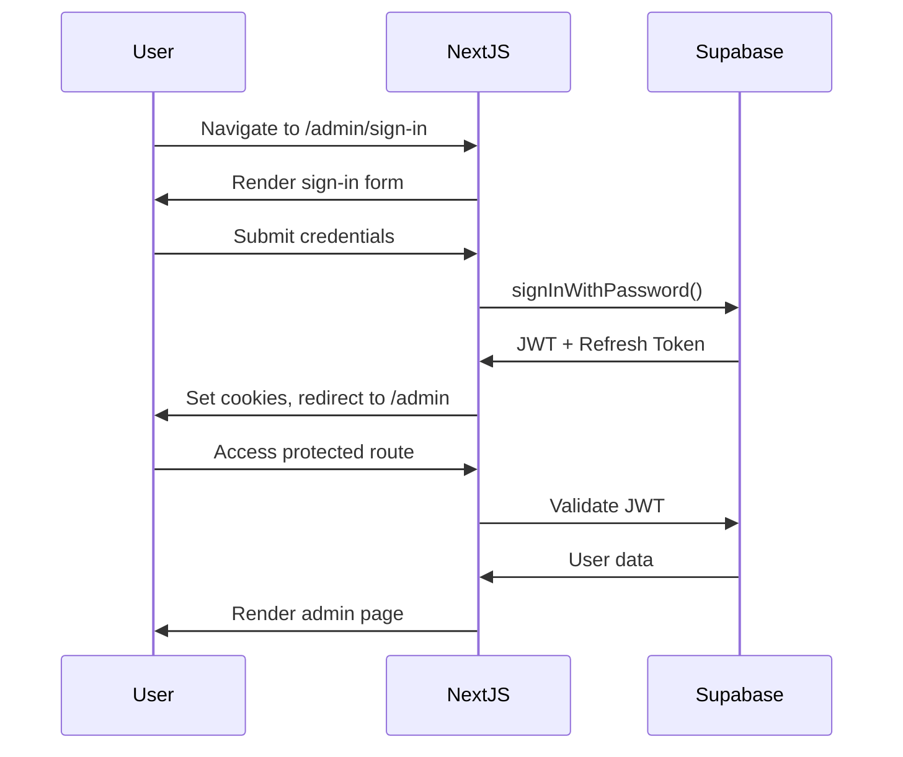

# Broadway Corporation - Technical Architecture

**Version:** 2.0.0  
**Backend:** Supabase  
**Date:** October 30, 2025

---

## Technology Stack

### Frontend Layer
```
Next.js 15.0 (App Router)
├── React 18.3 (Server Components + Client Components)
├── TypeScript 5.5 (strict mode)
├── Tailwind CSS 3.4
├── Radix UI (accessible components)
├── Framer Motion 11.0 (animations)
├── next-intl 4.3 (i18n)
└── Zod 3.23 (validation)
```

### Backend Layer (Supabase)
```
Supabase Platform
├── PostgreSQL 15 (database)
├── PostgREST (auto-generated REST API)
├── GoTrue (authentication)
├── Realtime (subscriptions)
└── Storage (file uploads)
```

### Infrastructure
```
Vercel (hosting)
├── Edge Network (CDN)
├── Serverless Functions
├── Analytics
└── Web Vitals monitoring

Sentry (error tracking)
```

---

## Architecture Patterns

### 1. Server-First Architecture

```typescript
// Server Components (default)
// Fetch data on server, stream HTML to client
export default async function Page() {
  const data = await fetchData(); // Server-side
  return <View data={data} />;
}

// Client Components (opt-in with 'use client')
'use client';
export function InteractiveComponent() {
  const [state, setState] = useState();
  return <Button onClick={() => setState(...)} />;
}
```

### 2. Database Access Patterns

#### Row Level Security (RLS)
```sql
-- Users can only see their own data
CREATE POLICY "Users can view own data"
ON profiles FOR SELECT
USING (auth.uid() = id);

-- Admins can see all data
CREATE POLICY "Admins can view all data"
ON profiles FOR SELECT
USING (auth.jwt() ->> 'role' = 'admin');
```

#### TypeScript Client
```typescript
import { createClient } from '@/lib/supabase/server';

export async function getEmployees() {
  const supabase = createClient();
  const { data, error } = await supabase
    .from('employees')
    .select('*')
    .order('created_at', { ascending: false });
    
  if (error) throw error;
  return data;
}
```

### 3. API Routes & Server Actions

#### Server Actions (preferred for mutations)
```typescript
'use server';
import { createClient } from '@/lib/supabase/server';
import { revalidatePath } from 'next/cache';

export async function createEmployee(formData: FormData) {
  const supabase = createClient();
  
  const { error } = await supabase
    .from('employees')
    .insert({
      name: formData.get('name'),
      role: formData.get('role'),
    });
    
  if (error) throw error;
  
  revalidatePath('/admin/employees');
  return { success: true };
}
```

#### Route Handlers (for APIs)
```typescript
// app/api/health/route.ts
export async function GET() {
  return Response.json({ ok: true, timestamp: Date.now() });
}
```

---

## Supabase Integration

### Client Types

#### 1. Server Client (Route Handlers, Server Actions)
```typescript
// lib/supabase/server.ts
import { createServerClient } from '@supabase/ssr';
import { cookies } from 'next/headers';

export function createClient() {
  const cookieStore = cookies();
  
  return createServerClient(
    process.env.NEXT_PUBLIC_SUPABASE_URL!,
    process.env.NEXT_PUBLIC_SUPABASE_ANON_KEY!,
    {
      cookies: {
        get(name) {
          return cookieStore.get(name)?.value;
        },
      },
    }
  );
}
```

#### 2. Browser Client (Client Components)
```typescript
// lib/supabase/client.ts
import { createBrowserClient } from '@supabase/ssr';

export function createClient() {
  return createBrowserClient(
    process.env.NEXT_PUBLIC_SUPABASE_URL!,
    process.env.NEXT_PUBLIC_SUPABASE_ANON_KEY!
  );
}
```

#### 3. Middleware Client (Auth checks)
```typescript
// middleware.ts
import { createServerClient } from '@supabase/ssr';
import { NextResponse } from 'next/server';

export async function middleware(request: Request) {
  const response = NextResponse.next();
  
  const supabase = createServerClient(
    process.env.NEXT_PUBLIC_SUPABASE_URL!,
    process.env.NEXT_PUBLIC_SUPABASE_ANON_KEY!,
    {
      cookies: {
        get(name) {
          return request.cookies.get(name)?.value;
        },
        set(name, value, options) {
          response.cookies.set({ name, value, ...options });
        },
        remove(name, options) {
          response.cookies.delete({ name, ...options });
        },
      },
    }
  );
  
  await supabase.auth.getUser();
  
  return response;
}
```

---

## Authentication Flow



---

## Data Flow Architecture

### Public Pages
```
User Request
  ↓
Next.js Server Component
  ↓
Supabase Client (server-side)
  ↓
PostgreSQL (with RLS)
  ↓
Data returned to component
  ↓
HTML streamed to client
```

### Admin Pages (Protected)
```
User Request
  ↓
Middleware (auth check)
  ├─ Authenticated → Continue
  └─ Not Authenticated → Redirect to sign-in
  ↓
Server Component (with user context)
  ↓
Supabase Client (with user JWT)
  ↓
PostgreSQL (RLS policies applied)
  ↓
Authorized data only
  ↓
Admin page rendered
```

---

## File Upload Strategy

### Supabase Storage
```typescript
import { createClient } from '@/lib/supabase/client';

export async function uploadImage(file: File, bucket: string) {
  const supabase = createClient();
  const fileName = `${Date.now()}-${file.name}`;
  
  const { data, error } = await supabase
    .storage
    .from(bucket)
    .upload(fileName, file);
    
  if (error) throw error;
  
  // Get public URL
  const { data: { publicUrl } } = supabase
    .storage
    .from(bucket)
    .getPublicUrl(fileName);
    
  return publicUrl;
}
```

### Storage Buckets
- `public/images` - Public website images
- `media/galleries` - Farm galleries, events
- `uploads/documents` - Job applications, attachments
- `admin/assets` - Admin-only files

---

## Performance Optimization

### 1. Server Components (Default)
- Reduce client-side JavaScript
- Fetch data on server
- Stream HTML progressively

### 2. Image Optimization
```tsx
import Image from 'next/image';

<Image
  src="/images/hero.jpg"
  alt="Broadway Farmhouse"
  width={1200}
  height={600}
  priority // Above-the-fold images
/>
```

### 3. Caching Strategy
```typescript
// Revalidate every 60 seconds
export const revalidate = 60;

// Or use Next.js cache tags
import { unstable_cache } from 'next/cache';

const getEvents = unstable_cache(
  async () => {
    const supabase = createClient();
    return supabase.from('events').select('*');
  },
  ['events'],
  { revalidate: 3600, tags: ['events'] }
);
```

---

## Security Architecture

### 1. Row Level Security (RLS)
All database tables have RLS enabled. Example:

```sql
-- Public read, admin write
ALTER TABLE blog_posts ENABLE ROW LEVEL SECURITY;

CREATE POLICY "Anyone can view published posts"
ON blog_posts FOR SELECT
USING (status = 'published');

CREATE POLICY "Admins can manage all posts"
ON blog_posts FOR ALL
USING (auth.jwt() ->> 'role' = 'admin');
```

### 2. Input Validation (Zod)
```typescript
import { z } from 'zod';

const employeeSchema = z.object({
  name: z.string().min(2).max(100),
  email: z.string().email().optional(),
  role: z.enum(['admin', 'editor', 'viewer']),
});

export type Employee = z.infer<typeof employeeSchema>;
```

### 3. CORS & CSRF Protection
```typescript
// next.config.mjs
const config = {
  async headers() {
    return [
      {
        source: '/api/:path*',
        headers: [
          { key: 'Access-Control-Allow-Origin', value: process.env.ALLOWED_ORIGIN },
          { key: 'X-Frame-Options', value: 'DENY' },
          { key: 'X-Content-Type-Options', value: 'nosniff' },
        ],
      },
    ];
  },
};
```

---

## Monitoring & Observability

### 1. Error Tracking (Sentry)
```typescript
import * as Sentry from '@sentry/nextjs';

Sentry.init({
  dsn: process.env.SENTRY_DSN,
  environment: process.env.NODE_ENV,
  tracesSampleRate: 0.1,
});
```

### 2. Performance Monitoring
```typescript
// Web Vitals tracking
import { onCLS, onFID, onFCP, onLCP, onTTFB } from 'web-vitals';

export function sendToAnalytics(metric) {
  fetch('/api/analytics/web-vitals', {
    method: 'POST',
    body: JSON.stringify(metric),
  });
}

onCLS(sendToAnalytics);
onLCP(sendToAnalytics);
// ...
```

### 3. Database Monitoring
- Supabase Dashboard (query performance, slow queries)
- pganalyze integration (optional)
- Real-time connection pool monitoring

---

## Environment Configuration

### Required Environment Variables
```bash
# Supabase
NEXT_PUBLIC_SUPABASE_URL=https://xxx.supabase.co
NEXT_PUBLIC_SUPABASE_ANON_KEY=eyJhbG...
SUPABASE_SERVICE_ROLE_KEY=eyJhbG... # Server-only

# Site
NEXT_PUBLIC_SITE_URL=https://broadwaycorp.com

# Monitoring
SENTRY_DSN=https://xxx@sentry.io/xxx

# Email (optional)
RESEND_API_KEY=re_xxx
```

---

## Deployment Architecture

```
GitHub Repository
  ↓
GitHub Actions (CI/CD)
  ↓
Vercel (production)
  ├─ Edge Network (global CDN)
  ├─ Serverless Functions
  └─ Edge Middleware (auth checks)
  ↓
Supabase (database + auth + storage)
  ├─ PostgreSQL (EU region)
  ├─ Storage (CDN)
  └─ Realtime (WebSocket)
```

---

## Migration from Firebase

### Completed
- ✅ Architecture design (Firebase → Supabase)
- ✅ Schema mapping (Firestore → PostgreSQL)

### In Progress
- 🔄 Data migration scripts
- 🔄 Auth migration (Firebase Auth → Supabase Auth)
- 🔄 Storage migration (Firebase Storage → Supabase Storage)

### Benefits of Supabase
1. **SQL Database:** Complex queries, joins, transactions
2. **Open Source:** No vendor lock-in, self-hostable
3. **Real-time:** Built-in subscriptions
4. **TypeScript:** Auto-generated types from schema
5. **Cost:** More predictable pricing

---

**Document Owner:** Principal Engineer  
**Last Updated:** October 30, 2025
