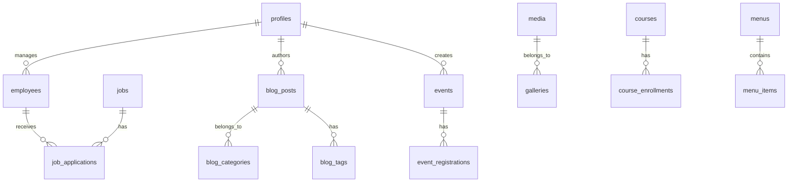

# Broadway Corporation - Database Schema

**Backend:** Supabase (PostgreSQL 15)  
**Version:** 2.0.0  
**Date:** October 30, 2025

---

## Schema Overview



---

## Core Tables

### 1. Authentication & Users

#### `profiles`
```sql
CREATE TABLE profiles (
  id UUID PRIMARY KEY REFERENCES auth.users(id) ON DELETE CASCADE,
  email TEXT UNIQUE NOT NULL,
  full_name TEXT,
  role TEXT NOT NULL DEFAULT 'viewer' CHECK (role IN ('admin', 'editor', 'viewer')),
  avatar_url TEXT,
  locale TEXT NOT NULL DEFAULT 'en' CHECK (locale IN ('en', 'fr')),
  created_at TIMESTAMPTZ NOT NULL DEFAULT NOW(),
  updated_at TIMESTAMPTZ NOT NULL DEFAULT NOW()
);

-- RLS Policies
ALTER TABLE profiles ENABLE ROW LEVEL SECURITY;

CREATE POLICY "Users can view own profile"
  ON profiles FOR SELECT
  USING (auth.uid() = id);

CREATE POLICY "Admins can view all profiles"
  ON profiles FOR SELECT
  USING (auth.jwt() ->> 'role' = 'admin');

CREATE POLICY "Users can update own profile"
  ON profiles FOR UPDATE
  USING (auth.uid() = id);
```

---

### 2. Content Management

#### `blog_posts`
```sql
CREATE TABLE blog_posts (
  id UUID PRIMARY KEY DEFAULT gen_random_uuid(),
  slug TEXT UNIQUE NOT NULL,
  title TEXT NOT NULL,
  excerpt TEXT,
  content TEXT NOT NULL,
  cover_image_url TEXT,
  author_id UUID REFERENCES profiles(id) ON DELETE SET NULL,
  status TEXT NOT NULL DEFAULT 'draft' CHECK (status IN ('draft', 'published', 'archived')),
  locale TEXT NOT NULL DEFAULT 'en' CHECK (locale IN ('en', 'fr')),
  published_at TIMESTAMPTZ,
  created_at TIMESTAMPTZ NOT NULL DEFAULT NOW(),
  updated_at TIMESTAMPTZ NOT NULL DEFAULT NOW()
);

-- Indexes
CREATE INDEX idx_blog_posts_status_published ON blog_posts(status, published_at DESC);
CREATE INDEX idx_blog_posts_slug ON blog_posts(slug);
CREATE INDEX idx_blog_posts_locale ON blog_posts(locale);

-- RLS
ALTER TABLE blog_posts ENABLE ROW LEVEL SECURITY;

CREATE POLICY "Anyone can view published posts"
  ON blog_posts FOR SELECT
  USING (status = 'published');

CREATE POLICY "Editors can manage all posts"
  ON blog_posts FOR ALL
  USING (auth.jwt() ->> 'role' IN ('admin', 'editor'));
```

#### `blog_categories`
```sql
CREATE TABLE blog_categories (
  id UUID PRIMARY KEY DEFAULT gen_random_uuid(),
  name TEXT NOT NULL,
  slug TEXT UNIQUE NOT NULL,
  description TEXT,
  created_at TIMESTAMPTZ NOT NULL DEFAULT NOW()
);

CREATE TABLE blog_post_categories (
  post_id UUID REFERENCES blog_posts(id) ON DELETE CASCADE,
  category_id UUID REFERENCES blog_categories(id) ON DELETE CASCADE,
  PRIMARY KEY (post_id, category_id)
);
```

#### `blog_tags`
```sql
CREATE TABLE blog_tags (
  id UUID PRIMARY KEY DEFAULT gen_random_uuid(),
  name TEXT UNIQUE NOT NULL,
  slug TEXT UNIQUE NOT NULL,
  created_at TIMESTAMPTZ NOT NULL DEFAULT NOW()
);

CREATE TABLE blog_post_tags (
  post_id UUID REFERENCES blog_posts(id) ON DELETE CASCADE,
  tag_id UUID REFERENCES blog_tags(id) ON DELETE CASCADE,
  PRIMARY KEY (post_id, tag_id)
);
```

---

#### `events`
```sql
CREATE TABLE events (
  id UUID PRIMARY KEY DEFAULT gen_random_uuid(),
  slug TEXT UNIQUE NOT NULL,
  title TEXT NOT NULL,
  description TEXT,
  location TEXT,
  start_at TIMESTAMPTZ NOT NULL,
  end_at TIMESTAMPTZ,
  image_url TEXT,
  division TEXT CHECK (division IN ('farmhouse', 'enterprise', 'intelligence', 'resorts')),
  status TEXT NOT NULL DEFAULT 'draft' CHECK (status IN ('draft', 'published', 'cancelled')),
  locale TEXT NOT NULL DEFAULT 'en' CHECK (locale IN ('en', 'fr')),
  max_attendees INTEGER,
  created_by UUID REFERENCES profiles(id) ON DELETE SET NULL,
  created_at TIMESTAMPTZ NOT NULL DEFAULT NOW(),
  updated_at TIMESTAMPTZ NOT NULL DEFAULT NOW()
);

CREATE INDEX idx_events_start_at ON events(start_at DESC);
CREATE INDEX idx_events_division ON events(division);

ALTER TABLE events ENABLE ROW LEVEL SECURITY;

CREATE POLICY "Anyone can view published events"
  ON events FOR SELECT
  USING (status = 'published');

CREATE POLICY "Editors can manage events"
  ON events FOR ALL
  USING (auth.jwt() ->> 'role' IN ('admin', 'editor'));
```

#### `event_registrations`
```sql
CREATE TABLE event_registrations (
  id UUID PRIMARY KEY DEFAULT gen_random_uuid(),
  event_id UUID REFERENCES events(id) ON DELETE CASCADE,
  name TEXT NOT NULL,
  email TEXT NOT NULL,
  phone TEXT,
  guests INTEGER DEFAULT 1,
  dietary_restrictions TEXT,
  activities JSONB,
  status TEXT NOT NULL DEFAULT 'pending' CHECK (status IN ('pending', 'confirmed', 'cancelled')),
  created_at TIMESTAMPTZ NOT NULL DEFAULT NOW()
);

CREATE INDEX idx_event_registrations_event ON event_registrations(event_id);
```

---

### 3. Employee & Jobs

#### `employees`
```sql
CREATE TABLE employees (
  id UUID PRIMARY KEY DEFAULT gen_random_uuid(),
  name TEXT NOT NULL,
  email TEXT,
  role TEXT NOT NULL,
  department TEXT,
  status TEXT NOT NULL DEFAULT 'active' CHECK (status IN ('active', 'inactive')),
  created_at TIMESTAMPTZ NOT NULL DEFAULT NOW(),
  updated_at TIMESTAMPTZ NOT NULL DEFAULT NOW()
);

ALTER TABLE employees ENABLE ROW LEVEL SECURITY;

CREATE POLICY "Admins can manage employees"
  ON employees FOR ALL
  USING (auth.jwt() ->> 'role' = 'admin');
```

#### `jobs`
```sql
CREATE TABLE jobs (
  id UUID PRIMARY KEY DEFAULT gen_random_uuid(),
  title TEXT NOT NULL,
  slug TEXT UNIQUE NOT NULL,
  description TEXT NOT NULL,
  requirements TEXT,
  department TEXT,
  location TEXT,
  type TEXT CHECK (type IN ('full-time', 'part-time', 'contract', 'internship')),
  status TEXT NOT NULL DEFAULT 'draft' CHECK (status IN ('draft', 'open', 'closed')),
  locale TEXT NOT NULL DEFAULT 'en' CHECK (locale IN ('en', 'fr')),
  created_at TIMESTAMPTZ NOT NULL DEFAULT NOW(),
  updated_at TIMESTAMPTZ NOT NULL DEFAULT NOW()
);

ALTER TABLE jobs ENABLE ROW LEVEL SECURITY;

CREATE POLICY "Anyone can view open jobs"
  ON jobs FOR SELECT
  USING (status = 'open');

CREATE POLICY "Admins can manage jobs"
  ON jobs FOR ALL
  USING (auth.jwt() ->> 'role' = 'admin');
```

#### `job_applications`
```sql
CREATE TABLE job_applications (
  id UUID PRIMARY KEY DEFAULT gen_random_uuid(),
  job_id UUID REFERENCES jobs(id) ON DELETE CASCADE,
  name TEXT NOT NULL,
  email TEXT NOT NULL,
  phone TEXT,
  resume_url TEXT,
  cover_letter TEXT,
  status TEXT NOT NULL DEFAULT 'pending' CHECK (status IN ('pending', 'reviewed', 'shortlisted', 'rejected', 'accepted')),
  created_at TIMESTAMPTZ NOT NULL DEFAULT NOW(),
  updated_at TIMESTAMPTZ NOT NULL DEFAULT NOW()
);

CREATE INDEX idx_job_applications_job ON job_applications(job_id);
```

---

### 4. Media & Galleries

#### `media`
```sql
CREATE TABLE media (
  id UUID PRIMARY KEY DEFAULT gen_random_uuid(),
  file_name TEXT NOT NULL,
  storage_path TEXT NOT NULL,
  public_url TEXT NOT NULL,
  mime_type TEXT,
  size_bytes BIGINT,
  width INTEGER,
  height INTEGER,
  alt_text TEXT,
  tags TEXT[],
  uploaded_by UUID REFERENCES profiles(id) ON DELETE SET NULL,
  created_at TIMESTAMPTZ NOT NULL DEFAULT NOW()
);

CREATE INDEX idx_media_tags ON media USING GIN(tags);

ALTER TABLE media ENABLE ROW LEVEL SECURITY;

CREATE POLICY "Anyone can view media"
  ON media FOR SELECT
  USING (true);

CREATE POLICY "Editors can manage media"
  ON media FOR ALL
  USING (auth.jwt() ->> 'role' IN ('admin', 'editor'));
```

#### `galleries`
```sql
CREATE TABLE galleries (
  id UUID PRIMARY KEY DEFAULT gen_random_uuid(),
  name TEXT NOT NULL,
  slug TEXT UNIQUE NOT NULL,
  description TEXT,
  division TEXT CHECK (division IN ('farmhouse', 'enterprise', 'intelligence', 'resorts')),
  cover_image_id UUID REFERENCES media(id) ON DELETE SET NULL,
  created_at TIMESTAMPTZ NOT NULL DEFAULT NOW()
);

CREATE TABLE gallery_images (
  gallery_id UUID REFERENCES galleries(id) ON DELETE CASCADE,
  media_id UUID REFERENCES media(id) ON DELETE CASCADE,
  sort_order INTEGER DEFAULT 0,
  PRIMARY KEY (gallery_id, media_id)
);
```

---

### 5. LMS (Intelligence Division)

#### `courses`
```sql
CREATE TABLE courses (
  id UUID PRIMARY KEY DEFAULT gen_random_uuid(),
  title TEXT NOT NULL,
  slug TEXT UNIQUE NOT NULL,
  description TEXT,
  curriculum JSONB,
  level TEXT CHECK (level IN ('beginner', 'intermediate', 'advanced')),
  duration_hours INTEGER,
  price_xaf INTEGER,
  instructor_ids UUID[],
  status TEXT NOT NULL DEFAULT 'draft' CHECK (status IN ('draft', 'published', 'archived')),
  locale TEXT NOT NULL DEFAULT 'en' CHECK (locale IN ('en', 'fr')),
  created_at TIMESTAMPTZ NOT NULL DEFAULT NOW(),
  updated_at TIMESTAMPTZ NOT NULL DEFAULT NOW()
);

ALTER TABLE courses ENABLE ROW LEVEL SECURITY;

CREATE POLICY "Anyone can view published courses"
  ON courses FOR SELECT
  USING (status = 'published');

CREATE POLICY "Admins can manage courses"
  ON courses FOR ALL
  USING (auth.jwt() ->> 'role' = 'admin');
```

#### `course_enrollments`
```sql
CREATE TABLE course_enrollments (
  id UUID PRIMARY KEY DEFAULT gen_random_uuid(),
  course_id UUID REFERENCES courses(id) ON DELETE CASCADE,
  student_name TEXT NOT NULL,
  student_email TEXT NOT NULL,
  student_phone TEXT,
  status TEXT NOT NULL DEFAULT 'pending' CHECK (status IN ('pending', 'enrolled', 'completed', 'cancelled')),
  enrolled_at TIMESTAMPTZ NOT NULL DEFAULT NOW()
);
```

---

### 6. Resorts (Menus)

#### `menus`
```sql
CREATE TABLE menus (
  id UUID PRIMARY KEY DEFAULT gen_random_uuid(),
  name TEXT NOT NULL,
  slug TEXT UNIQUE NOT NULL,
  description TEXT,
  active BOOLEAN DEFAULT true,
  created_at TIMESTAMPTZ NOT NULL DEFAULT NOW()
);

CREATE TABLE menu_items (
  id UUID PRIMARY KEY DEFAULT gen_random_uuid(),
  menu_id UUID REFERENCES menus(id) ON DELETE CASCADE,
  name TEXT NOT NULL,
  description TEXT,
  price_xaf INTEGER NOT NULL,
  category TEXT,
  tags TEXT[],
  image_url TEXT,
  available BOOLEAN DEFAULT true,
  sort_order INTEGER DEFAULT 0,
  created_at TIMESTAMPTZ NOT NULL DEFAULT NOW()
);

CREATE INDEX idx_menu_items_menu ON menu_items(menu_id, sort_order);
```

---

### 7. Contact & Subscriptions

#### `contacts`
```sql
CREATE TABLE contacts (
  id UUID PRIMARY KEY DEFAULT gen_random_uuid(),
  name TEXT NOT NULL,
  email TEXT NOT NULL,
  subject TEXT,
  message TEXT NOT NULL,
  status TEXT NOT NULL DEFAULT 'new' CHECK (status IN ('new', 'read', 'replied', 'archived')),
  created_at TIMESTAMPTZ NOT NULL DEFAULT NOW()
);

CREATE INDEX idx_contacts_status ON contacts(status, created_at DESC);

ALTER TABLE contacts ENABLE ROW LEVEL SECURITY;

CREATE POLICY "Admins can view contacts"
  ON contacts FOR SELECT
  USING (auth.jwt() ->> 'role' IN ('admin', 'editor'));
```

#### `newsletter_subscribers`
```sql
CREATE TABLE newsletter_subscribers (
  id UUID PRIMARY KEY DEFAULT gen_random_uuid(),
  email TEXT UNIQUE NOT NULL,
  locale TEXT NOT NULL DEFAULT 'en' CHECK (locale IN ('en', 'fr')),
  status TEXT NOT NULL DEFAULT 'active' CHECK (status IN ('active', 'unsubscribed')),
  subscribed_at TIMESTAMPTZ NOT NULL DEFAULT NOW(),
  unsubscribed_at TIMESTAMPTZ
);

CREATE INDEX idx_subscribers_status ON newsletter_subscribers(status);
```

---

## Storage Buckets

### Supabase Storage Configuration

```sql
-- Public bucket for website images
INSERT INTO storage.buckets (id, name, public)
VALUES ('public-images', 'public-images', true);

-- Media galleries (public)
INSERT INTO storage.buckets (id, name, public)
VALUES ('galleries', 'galleries', true);

-- Document uploads (private)
INSERT INTO storage.buckets (id, name, public)
VALUES ('documents', 'documents', false);

-- Admin assets (private)
INSERT INTO storage.buckets (id, name, public)
VALUES ('admin-assets', 'admin-assets', false);
```

### Storage Policies

```sql
-- Anyone can view public images
CREATE POLICY "Public images viewable by all"
ON storage.objects FOR SELECT
USING (bucket_id = 'public-images');

-- Admins can upload to public images
CREATE POLICY "Admins can upload public images"
ON storage.objects FOR INSERT
WITH CHECK (
  bucket_id = 'public-images' 
  AND auth.jwt() ->> 'role' IN ('admin', 'editor')
);

-- Users can view own documents
CREATE POLICY "Users can view own documents"
ON storage.objects FOR SELECT
USING (
  bucket_id = 'documents'
  AND (storage.foldername(name))[1] = auth.uid()::text
);
```

---

## Database Functions

### Auto-update `updated_at`

```sql
CREATE OR REPLACE FUNCTION update_updated_at_column()
RETURNS TRIGGER AS $$
BEGIN
  NEW.updated_at = NOW();
  RETURN NEW;
END;
$$ LANGUAGE plpgsql;

-- Apply to all tables with updated_at
CREATE TRIGGER update_profiles_updated_at
  BEFORE UPDATE ON profiles
  FOR EACH ROW
  EXECUTE FUNCTION update_updated_at_column();

-- Repeat for other tables...
```

### Slug generation

```sql
CREATE OR REPLACE FUNCTION generate_slug(title TEXT)
RETURNS TEXT AS $$
BEGIN
  RETURN lower(regexp_replace(title, '[^a-zA-Z0-9]+', '-', 'g'));
END;
$$ LANGUAGE plpgsql;
```

---

## Indexes for Performance

```sql
-- Blog posts
CREATE INDEX idx_blog_posts_author ON blog_posts(author_id);
CREATE INDEX idx_blog_posts_published ON blog_posts(published_at DESC) WHERE status = 'published';

-- Events
CREATE INDEX idx_events_upcoming ON events(start_at) WHERE status = 'published' AND start_at > NOW();

-- Media
CREATE INDEX idx_media_uploaded ON media(uploaded_by, created_at DESC);

-- Full-text search (optional)
CREATE INDEX idx_blog_posts_search ON blog_posts USING GIN(to_tsvector('english', title || ' ' || content));
```

---

## Migration Scripts

See `supabase/migrations/` for versioned migration files.

**Document Owner:** Database Engineer  
**Last Updated:** October 30, 2025
