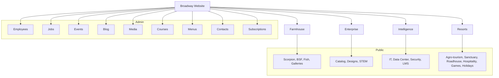

# Broadway Corporation — Product Brief (CTO)

Version: 1.1 | Date: 2025-08-09 | Author: CTO

## Executive summary

Broadway’s web platform consolidates four divisions — Farmhouse, Enterprise, Intelligence, Resorts — into one brand-consistent site with an Admin Dashboard for internal operations. Objectives: global reach, scalable content operations, measurable performance and accessibility.

## Divisions and outcomes

- Farmhouse: showcase sustainable agriculture; drive farm tours and education
- Enterprise: catalog + lead gen for lab equipment/designs; STEM outreach
- Intelligence: IT/security services + LMS; convert service inquiries
- Resorts: hospitality and agro-tourism; convert to bookings/inquiries

## Cross-cutting capabilities

- Public: EN/FR i18n, SEO, responsive, unified navigation/brand
- Admin: employees, jobs, events, blog, media, courses, menus, contacts, subscriptions

## Technology choices (decisions)

- Next.js 15 + TypeScript, Tailwind, Radix, Framer Motion
- Firebase (Firestore, Storage). Hosting on Vercel (primary)
- i18n: next-intl
- Analytics/Observability: Vercel Analytics, optional Sentry

## KPIs

- LCP ≤ 1.5s (mobile), Lighthouse ≥ 90 across P/A/S
- +25% direct traffic in 6 months
- -30% time-to-publish for admins

## Visual feature map

## Risks and mitigations

- Scope creep across divisions → gated roadmap, quarterly planning
- Content bottlenecks → Admin Dashboard with roles/workflows
- Performance regressions → budgets, CI checks, image policy
- i18n drift → translation pipeline, fallbacks, lint rules

## Roadmap (next steps)

1. Approve architecture and repo structure (see root `README.md`)
2. Finalize i18n framework and copy sources
3. Confirm UI system and tokens (see `docs/UI-DESIGN.md`)
4. Sprint 1: Public shell + navigation + Farmhouse MVP
5. Sprint 2: Admin core + Events/Blog
6. Sprint 3: Enterprise catalog + Intelligence services

---

References

- Engineering setup and operations: `README.md`
- UI/UX specifications: `docs/UI-DESIGN.md`
